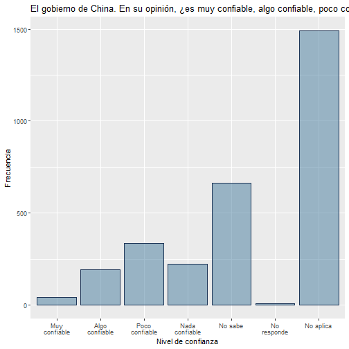
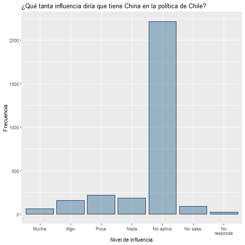
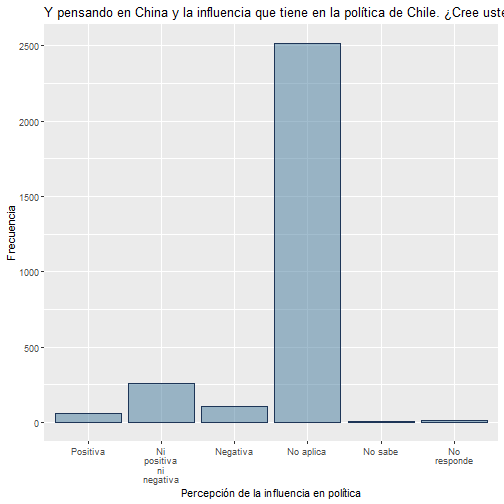

```r
## En base a la información entregada en la encuesta 2021 de Latinobarómetro (LAPOP) se encuentra la siguiente información sobre la percepción de los chilenos en el año 2021, representada en un gráfico de barras, de forma que sea más simple visualizar la frecuencia de las respuestas:

CHL_2021_LAPOP %>% 
  ggplot(aes(x=as_factor(mil10a))) +
  
  geom_bar(color="#1d3557",fill="#457b9d",alpha=0.5)+
  scale_x_discrete(labels = function(x) str_wrap(x, width = 10))+
  labs(title = "El gobierno de China. En su opinión, ¿es muy confiable, algo confiable, poco confiable, nada confiable, o no tiene opinión?",
       x="Nivel de confianza", y="Frecuencia")
```




```r
##A continuación hago el mismo ejercicio con la influencia percibida por chilenos de China sobre la política chilena:

CHL_2021_LAPOP %>% 
  ggplot(aes(x=as_factor(ccch4))) +
  
  geom_bar(color="#1d3557",fill="#457b9d",alpha=0.5)+
  scale_x_discrete(labels = function(x) str_wrap(x, width = 10))+
  labs(title = "¿Qué tanta influencia diría que tiene China en la política de Chile?",
       x="Nivel de influencia", y="Frecuencia")
```




```r
## Repito lo mismo con la percepción de esta influencia:
CHL_2021_LAPOP %>% 
  ggplot(aes(x=as_factor(ccch6))) +
  
  geom_bar(color="#1d3557",fill="#457b9d",alpha=0.5)+
  scale_x_discrete(labels = function(x) str_wrap(x, width = 10))+
  labs(title = "Y pensando en China y la influencia que tiene en la política de Chile. ¿Cree usted que esa influencia es...",
       x="Percepción de la influencia en política", y="Frecuencia")
```


