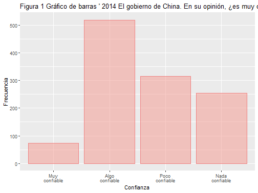
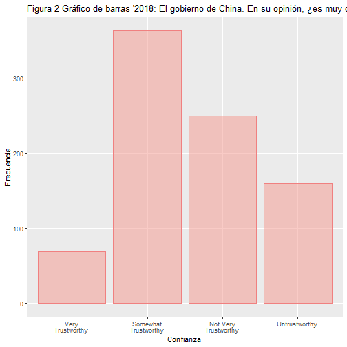
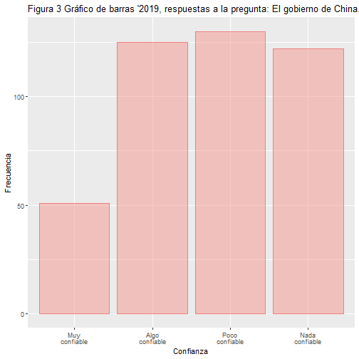
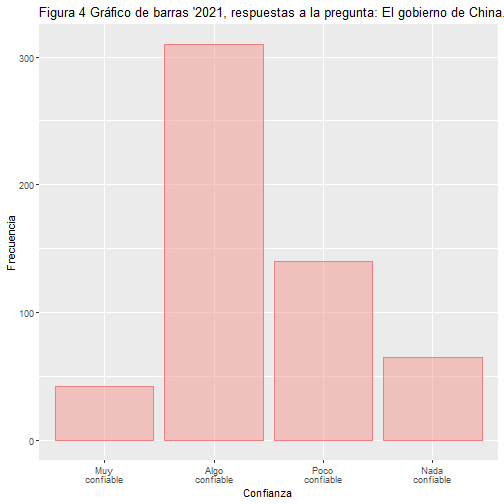

### **Hipótesis y variables de interés:**

En mi proyecto para la clase busco evaluar si las relaciones diplomáticas entre entre China y Estados Unidos en la última decada ha tenido o no un efecto en la confianza de los chilenos en China.
Preguntas clase: ¿Ha afectado el conflicto a la percepción del país en Chile?
¿Es suficiente el soft power ejercido por China para ¿Es suficiente el soft power para sobreponerse a los impactos que tiene el conflicto diplomático entre dos grandes potencias económicas y políticas?

Hipótesis: La existencia de conflictos entre Estados Unidos y China afectan la confianza de los chilenos en el gobierno chino.
correspondiente a tensiones internacionales en las que se ve envuelto este?

**H0:** *No existe una relación entre la existencia de tensiones diplomáticas entre China-Taiwán-Estados Unidos y la confianza de los chilenos en gobierno chino.*

**H1:** *Una peor percepción del gobierno chino por los chilenos se debe a la existencia de tensiones diplomáticas entre Estados Unidos y China*.

**Variable independiente:** Número de visitas por parte de jefes de Estado y gobierno desde China hacia Estados Unidos

**Variable dependiente:** Nivel de confianza de los chilenos hacia China

### **Revisión de literatura:**

La estrategia china de ""Going-Out"" ha tomado especial protagonismo en la última década en Latinoamérica, presentándose como una alternativa a la presencia dominante de Estados Unidos.
La teoría de estabilidad hegemónica de Krasner indica que para que haya un sistema económico de libre comercio estable, debe existir una potencia hegemónica, y el ascenso de un hegemón permite una mayor apertura de los países a verse envueltos en intercambios comerciales con Tratados de Libre Comercio, bajas en las tarifas, etc.
Si bien el ""China Triangle"" (Gallagher) demuestra que China entró fuertemente a países donde la influencia de Estados Unidos era menor, el desembarco en América Latina ya lleva alrededor de una década, y en Chile se han realizado grandes inversiones en el sector energético, minero y petrolero.
El ascenso de China como socio comercial predominante en América Latina se presenta como una amenaza para Estados Unidos, país con el que desde el 2018 sostiene una guerra comercial, sumada a tensiones diplomáticas debido a la constante amenaza de China a Taiwán.

En el caso chileno, las relaciones bilaterales han sido usualmente separadas completamente con respecto al rol político de China y su rol económico, pero no contamos con una evaluación de si la estrategia diplomática de China de los últimos años, y los conflictos en los que se ha visto envuelto el país han impactado también en la confianza que tienen los chilenos en China como gobierno.
En la literatura existe una discusión constante sobre la imagen global de China, y si su estrategia de "Going-Out" con un acercamiento económico a países en África, Asia y América ha realmente aventajado al país a pesar de los conflictos diplomáticos en los que se han visto envueltos en los últimos cinco años.
Silver (2021) indica que es el liderazgo de Xi el que ha empeorado la imagen global de China en comparación a un reciente ascenso de la imagen de Estados Unidos tras la elección de Joe Biden como presidente, ya que la percepción de este último país había bajado significativamente cuando Donald Trump lideró el país.

Con respecto al rol económico de China, la encuesta realizada por el Pew Research Center (2021) indica que ""alrededor de la mitad (de países participantes en la encuesta) dicen que es más importante para sus naciones tener lazos económicos fuertes con Estados Unidos que con China"" (2021).
Una idea similar expresa Armony y Velásquez (2015), quienes a través del análisis de comunidades latinoamericanas, indican que si bien el tema económico ha tomado relevancia en cuanto a la relación de China con Latinoamérica, muchas personas también expresaban preocupación sobre los términos de ese acercamiento.
Este temor se expresaba especialmente en materias de impacto ambiental y la ""sed creciente de China de bienes de consumo (2015), lo que seguiría una tendencia extractivista en la región.
Al explicar por qué la imagen de China estaría empeorando, Kurlantzick (2022) indica que también el manejo de algunas de las iniciativas del Belt and Road Initiative han elicitado respuestas negativas debido a que algunos países están acumulando más deuda de la que tenían esperada.
Otro aspecto que impactó fue también el manejo inicial de la pandemia COVID-19, que generó desconfianza en el gobierno chino (2022).

**Análisis descriptivo de los datos de la encuesta LAPOP para Chile 2014**.

Pregunta MIL10A: El gobierno de China.
En su opinión, ¿es muy confiable, algo confiable, poco confiable, nada confiable, o no tiene opinión?


```r
library(knitr)
library(ggplot2)
library(dplyr)
library(tidyverse)
library("knitr")
knit2html("CL_LAPOP_2014.dta")
```

```
## 
## 
## processing file: CL_LAPOP_2014.dta
```

```
## 
  |                                                                                         
  |                                                                                   |   0%
  |                                                                                         
  |...................................................................................| 100%
##   ordinary text without R code
```

```
## output file: CL_LAPOP_2014.txt
```

```r
CL_LAPOP_2014 %>% select(mil10a)
```

```
## # A tibble: 1,571 × 1
##    mil10a                
##    <dbl+lbl>             
##  1 NA(a) [No Sabe]       
##  2     3 [Poco confiable]
##  3     4 [Nada confiable]
##  4 NA(a) [No Sabe]       
##  5     2 [Algo confiable]
##  6 NA(a) [No Sabe]       
##  7     4 [Nada confiable]
##  8     2 [Algo confiable]
##  9     1 [Muy confiable] 
## 10     3 [Poco confiable]
## # … with 1,561 more rows
```

```r
# Rango
range(CL_LAPOP_2014$mil10a, na.rm = TRUE)
```

```
## <labelled<double>[2]>: Confiabilidad del gobierno chino
## [1] 1 4
## 
## Labels:
##  value          label
##      1  Muy confiable
##      2 Algo confiable
##      3 Poco confiable
##      4 Nada confiable
##  NA(a)        No Sabe
##  NA(b)    No Responde
```

```r
# Promedio
mean(CL_LAPOP_2014$mil10a, na.rm = TRUE)
```

```
## [1] 2.644884
```

```r
# Mediana
median(CL_LAPOP_2014$mil10a, na.rm = TRUE)
```

```
## [1] 2
```

```r
# Rango intercuartil
IQR(CL_LAPOP_2014$mil10a, na.rm = TRUE)
```

```
## [1] 1
```

```r
# Varianza
var(CL_LAPOP_2014$mil10a, na.rm = TRUE)
```

```
## [1] 0.7937496
```

```r
# Desviación típica
sd(CL_LAPOP_2014$mil10a, na.rm = TRUE)
```

```
## [1] 0.8909263
```

**Gráficos descriptivos: Confianza en China, año 2014.**


```r
library(dplyr)
knit2html("CL_LAPOP_2014.dta")
```

```
## 
## 
## processing file: CL_LAPOP_2014.dta
```

```
## 
  |                                                                                         
  |                                                                                   |   0%
  |                                                                                         
  |...................................................................................| 100%
##   ordinary text without R code
```

```
## output file: CL_LAPOP_2014.txt
```

```r
CL_LAPOP_2014 %>%
  drop_na(mil10a) %>%
  ggplot(aes(x=as_factor(mil10a))) +
  geom_bar(color="#f08080",fill="#f4978e",alpha=0.5)+
  scale_x_discrete(labels = function(x) str_wrap(x, width = 10))+
  labs(title = "Figura 1 Gráfico de barras ' 2014 El gobierno de China. En su opinión, ¿es muy confiable, algo confiable, poco confiable, nada confiable, o no tiene opinión?'",
       x="Confianza", y="Frecuencia")
```



**Análisis descriptivo 2018:**


```r
knit2html("CL_LAPOP_2018.dta")
```

```
## 
## 
## processing file: CL_LAPOP_2018.dta
```

```
## 
  |                                                                                         
  |                                                                                   |   0%
  |                                                                                         
  |...................................................................................| 100%
##   ordinary text without R code
```

```
## output file: CL_LAPOP_2018.txt
```

```r
CL_LAPOP_2018 %>%
  select(mil10a)
```

```
## # A tibble: 1,625 × 1
##    mil10a                      
##    <dbl+lbl>                   
##  1 NA(a) [Don't Know]          
##  2     3 [Not Very Trustworthy]
##  3 NA(a) [Don't Know]          
##  4 NA(a) [Don't Know]          
##  5 NA(a) [Don't Know]          
##  6     2 [Somewhat Trustworthy]
##  7 NA(a) [Don't Know]          
##  8     3 [Not Very Trustworthy]
##  9 NA(a) [Don't Know]          
## 10     2 [Somewhat Trustworthy]
## # … with 1,615 more rows
```

```r
# Rango
range(CL_LAPOP_2018$mil10a, na.rm = TRUE)
```

```
## <labelled<double>[2]>: Trustworthiness of Chinese Government
## [1] 1 4
## 
## Labels:
##  value                label
##      1     Very Trustworthy
##      2 Somewhat Trustworthy
##      3 Not Very Trustworthy
##      4        Untrustworthy
##  NA(a)           Don't Know
##  NA(b)          No Response
##  NA(c)       Not Applicable
```

```r
# Promedio
mean(CL_LAPOP_2018$mil10a, na.rm = TRUE)
```

```
## [1] 2.594306
```

```r
# Mediana
median(CL_LAPOP_2018$mil10a, na.rm = TRUE)
```

```
## [1] 2
```

```r
# Rango intercuartil
IQR(CL_LAPOP_2018$mil10a, na.rm = TRUE)
```

```
## [1] 1
```

```r
# Varianza
var(CL_LAPOP_2018$mil10a, na.rm = TRUE)
```

```
## [1] 0.7853357
```

```r
# Desviación típica
sd(CL_LAPOP_2018$mil10a, na.rm = TRUE)
```

```
## [1] 0.8861917
```

**Gráficos descriptivos: Confianza en China, año 2014.**


```r
knit2html("CL_LAPOP_2018.dta")
```

```
## 
## 
## processing file: CL_LAPOP_2018.dta
```

```
## 
  |                                                                                         
  |                                                                                   |   0%
  |                                                                                         
  |...................................................................................| 100%
##   ordinary text without R code
```

```
## output file: CL_LAPOP_2018.txt
```

```r
CL_LAPOP_2018 %>%
  drop_na(mil10a) %>%
  ggplot(aes(x=as_factor(mil10a))) +
  geom_bar(color="#f08080",fill="#f4978e",alpha=0.5)+
  scale_x_discrete(labels = function(x) str_wrap(x, width = 10))+
  labs(title = "Figura 2 Gráfico de barras '2018: El gobierno de China. En su opinión, ¿es muy confiable, algo confiable, poco confiable, nada confiable, o no tiene opinión?'",
       x="Confianza", y="Frecuencia")
```



**Análisis descriptivo 2019:**


```r
knit2html("CL_LAPOP_2019.dta")
```

```
## 
## 
## processing file: CL_LAPOP_2019.dta
```

```
## 
  |                                                                                         
  |                                                                                   |   0%
  |                                                                                         
  |...................................................................................| 100%
##   ordinary text without R code
```

```
## output file: CL_LAPOP_2019.txt
```

```r
CL_LAPOP_2019 %>%
  select(mil10a)
```

```
## # A tibble: 1,638 × 1
##    mil10a           
##    <dbl+lbl>        
##  1 NA(c) [No Aplica]
##  2 NA(c) [No Aplica]
##  3 NA(a) [No sabe]  
##  4 NA(a) [No sabe]  
##  5 NA(a) [No sabe]  
##  6 NA(c) [No Aplica]
##  7 NA(c) [No Aplica]
##  8 NA(c) [No Aplica]
##  9 NA(c) [No Aplica]
## 10 NA(a) [No sabe]  
## # … with 1,628 more rows
```

```r
# Rango
range(CL_LAPOP_2019$mil10a, na.rm = TRUE)
```

```
## <labelled<double>[2]>: Confiabilidad del gobierno chino
## [1] 1 4
## 
## Labels:
##  value          label
##      1  Muy confiable
##      2 Algo confiable
##      3 Poco confiable
##      4 Nada confiable
##  NA(a)        No sabe
##  NA(b)    No responde
##  NA(c)      No Aplica
```

```r
# Promedio
mean(CL_LAPOP_2019$mil10a, na.rm = TRUE)
```

```
## [1] 2.754673
```

```r
# Mediana
median(CL_LAPOP_2019$mil10a, na.rm = TRUE)
```

```
## [1] 3
```

```r
# Rango intercuartil
IQR(CL_LAPOP_2019$mil10a, na.rm = TRUE)
```

```
## [1] 2
```

```r
# Varianza
var(CL_LAPOP_2019$mil10a, na.rm = TRUE)
```

```
## [1] 0.9958798
```

```r
# Desviación típica
sd(CL_LAPOP_2019$mil10a, na.rm = TRUE)
```

```
## [1] 0.9979377
```

**Gráficos descriptivos: Confianza en China, año 2019.**


```r
knit2html("CL_LAPOP_2019.dta")
```

```
## 
## 
## processing file: CL_LAPOP_2019.dta
```

```
## 
  |                                                                                         
  |                                                                                   |   0%
  |                                                                                         
  |...................................................................................| 100%
##   ordinary text without R code
```

```
## output file: CL_LAPOP_2019.txt
```

```r
CL_LAPOP_2019 %>%
  drop_na(mil10a) %>%
  ggplot(aes(x=as_factor(mil10a))) +
  geom_bar(color="#f08080",fill="#f4978e",alpha=0.5)+
  scale_x_discrete(labels = function(x) str_wrap(x, width = 10))+
  labs(title = "Figura 3 Gráfico de barras '2019, respuestas a la pregunta: El gobierno de China. En su opinión, ¿es muy confiable, algo confiable, poco confiable, nada confiable, o no tiene opinión?'",
       x="Confianza", y="Frecuencia")
```



**Análisis descriptivo 2021:**


```r
knitr::opts_chunk$set(echo = TRUE)
CL_LAPOP_2021 %>%
  select(mil10a)
```

```
## # A tibble: 1,571 × 1
##    mil10a                
##    <dbl+lbl>             
##  1 NA(c) [N/A]           
##  2 NA(c) [N/A]           
##  3     2 [Algo confiable]
##  4     3 [Poco confiable]
##  5 NA(c) [N/A]           
##  6 NA(c) [N/A]           
##  7 NA(c) [N/A]           
##  8 NA(c) [N/A]           
##  9 NA(c) [N/A]           
## 10 NA(a) [DK]            
## # … with 1,561 more rows
```

```r
# Rango
range(CL_LAPOP_2021$mil10a, na.rm = TRUE)
```

```
## <labelled<double>[2]>: MIL10A El gobierno de China, en su opinión ¿es muy confiable, algo confiable, po
## [1] 1 4
## 
## Labels:
##  value                      label
##      1              Muy confiable
##      2             Algo confiable
##      3             Poco confiable
##      4             Nada confiable
##     88 No sabe / no tiene opinión
##     98                         NR
##     99                       INAP
##  NA(a)                         DK
##  NA(b)                         NR
##  NA(c)                        N/A
```

```r
# Promedio
mean(CL_LAPOP_2021$mil10a, na.rm = TRUE)
```

```
## [1] 2.409336
```

```r
# Mediana
median(CL_LAPOP_2021$mil10a, na.rm = TRUE)
```

```
## [1] 2
```

```r
# Rango intercuartil
IQR(CL_LAPOP_2021$mil10a, na.rm = TRUE)
```

```
## [1] 1
```

```r
# Varianza
var(CL_LAPOP_2021$mil10a, na.rm = TRUE)
```

```
## [1] 0.6271069
```

```r
# Desviación típica
sd(CL_LAPOP_2021$mil10a, na.rm = TRUE)
```

```
## [1] 0.7919008
```

**Gráficos descriptivos: Confianza en China, año 2021.**


```r
CL_LAPOP_2021 %>%
  drop_na(mil10a) %>%
  ggplot(aes(x=as_factor(mil10a))) +
  geom_bar(color="#f08080",fill="#f4978e",alpha=0.5)+
  scale_x_discrete(labels = function(x) str_wrap(x, width = 10))+
  labs(title = "Figura 4 Gráfico de barras '2021, respuestas a la pregunta: El gobierno de China. En su opinión, ¿es muy confiable, algo confiable, poco confiable, nada confiable, o no tiene opinión?'",
       x="Confianza", y="Frecuencia")
```


